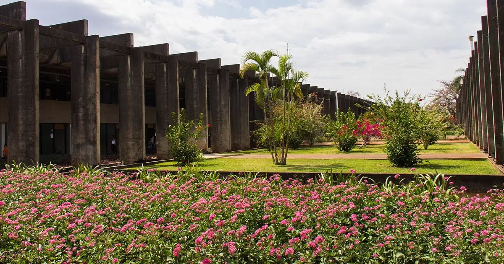

  

<h1 align="center">Hi, I'm Heitor Matias Trindade 👋</h1>

  Artificial Intelligence undergraduate at the University of Brasília (UnB) 
  Building practical AI, machine learning, and software projects

  <a href="https://www.linkedin.com/in/heitor-matias-trindade-5b394b407/">LinkedIn</a>
  ·
  <a href="https://github.com/heitor1736?tab=repositories">Projects</a>

## About me

- 🎓 Member of the **first cohort of the Bachelor's degree in Artificial Intelligence at UnB**.
- 🤖 Interested in applied AI, machine learning, local LLMs, data, and software engineering.
- 🧠 I enjoy turning complex ideas into useful, understandable tools.
- 🌎 Portuguese native and English speaker.
- 💼 Open to internships and junior opportunities across AI, data, software, and related technology roles.

## Selected projects

### 🍄 [Mushroom KNN from Scratch](https://github.com/heitor1736/Mushroom-KNN-from-scratch)

A complete K-Nearest Neighbors classifier written in pure Python, without NumPy or scikit-learn. It includes categorical preprocessing, feature standardization, Euclidean distance calculation, and majority voting to classify mushrooms as edible or poisonous.

### 🎙️ Jarvis — Intelligent Meeting Assistant *(in development)*

An AI assistant designed to transcribe and translate meetings in real time, write organized notes, explain unfamiliar topics on demand, and analyze supporting documents.

### 🧩 Local AI Workspace *(in development)*

A privacy-oriented local AI environment powered by open-source language models, exploring how capable assistants can run directly on personal hardware.

### ⚡ [MatSpeed](https://github.com/heitor1736/MatSpeed)

A browser-based mental arithmetic project focused on quick practice and an accessible user experience.

## Technical interests

`Python` · `C` · `JavaScript` · `Machine Learning` · `LLMs` · `NLP` · `Data Science` · `Git & GitHub`

## Em português

Sou estudante da primeira turma do Bacharelado em Inteligência Artificial da Universidade de Brasília. Tenho interesse em IA aplicada, aprendizado de máquina, modelos locais, dados e desenvolvimento de software. Busco oportunidades para aprender rápido, colaborar com equipes e transformar ideias em produtos úteis.

---

<em>Learning deeply, building openly, and using AI to solve real problems.</em>

